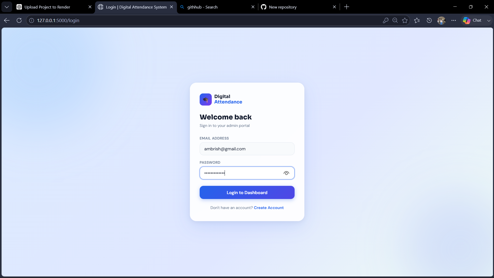
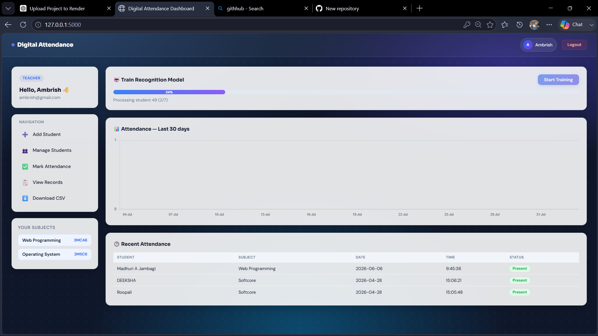
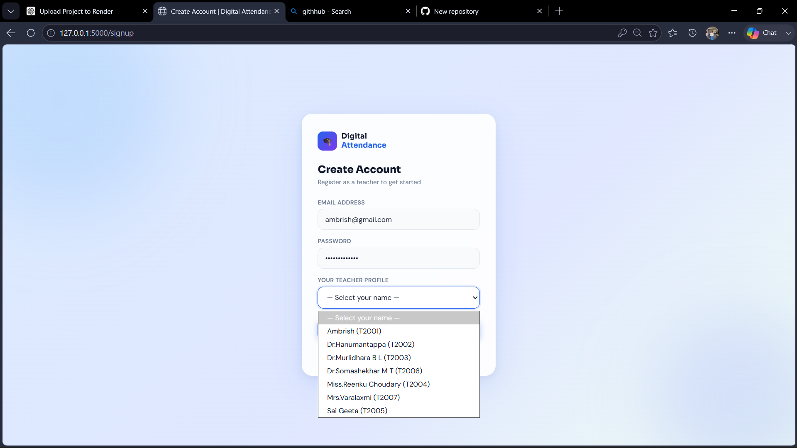
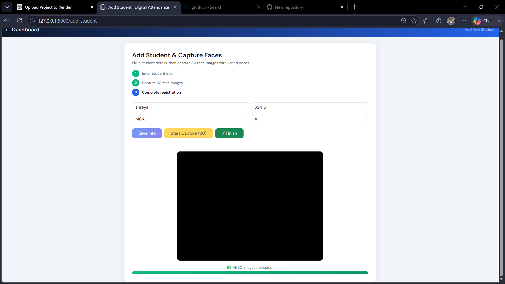
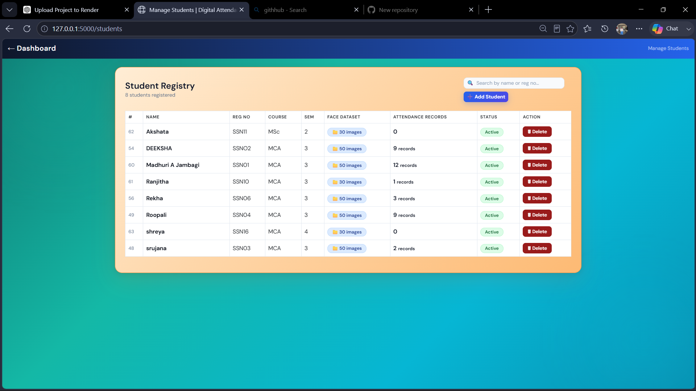
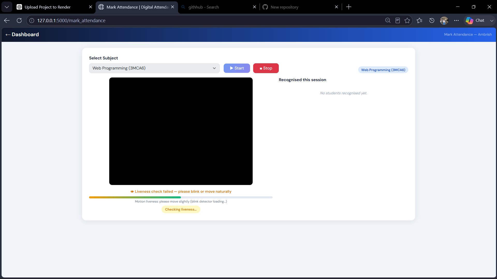
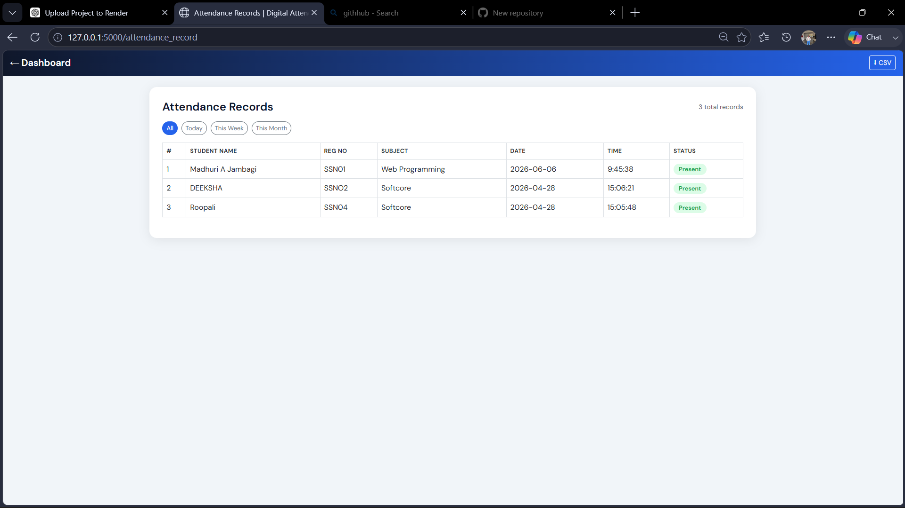

# 🎓 Digital Facial Recognition Attendance System


A **Flask-based facial attendance system** that uses **Computer Vision (OpenCV)** and a **Machine Learning (SVM) classifier** to detect and mark student attendance in real time, with a MySQL backend and role-based (admin / teacher / student) login.

---

## 🚀 Project Overview

The system captures a student's face through a webcam, trains an ML model on the captured images, and later recognizes students automatically to mark attendance in a MySQL database — replacing manual roll-calls with a faster, auditable process.

Recognition also runs a **liveness check** (texture, focus, and highlight analysis) to make it harder to mark attendance from a printed photo or a phone screen held up to the camera.

---

## 🧠 Core Technologies

* **Python (Flask)** – backend & routing
* **OpenCV** – face detection & image preprocessing
* **scikit-learn (SVM + `CalibratedClassifierCV`)** – face classification with confidence scores
* **scikit-image (LBP)** – texture-based face features, with a pure-NumPy fallback
* **MySQL** – persistent storage
* **HTML / CSS / JavaScript** – frontend

---

## ⚙️ How the System Works

1. **Add Student** — enter details, capture face images via webcam (`add_student.html` + `static/js/camera_add_student.js`), images are stored under `dataset/<student_id>/`.
2. **Train Model** — each image is converted to grayscale, face-detected, lighting-normalised, resized to 80×80, and turned into a 450-dim LBP feature vector; an SVM is trained on the result (`model.py: train_model_background`).
3. **Recognize Face** — a live frame goes through the same feature pipeline, a liveness check, then the trained model predicts a student ID with a confidence score (`app.py: recognize_face`).
4. **Mark Attendance** — a confident, live, non-duplicate match is written to the `attendance` table with date, time, subject, and teacher.

---

## 🗄️ Database Design (MySQL)

Database: `facial_attendance_mini_project`

| Table | Purpose |
|---|---|
| `student` | student_id (PK), name, reg_no, course, semester, is_active |
| `subject` | subject_id (PK), subject_name, semester, course |
| `teacher` | teacher_id (PK), TEACHER_CODE, name, email |
| `teacher_subject` | links a teacher to the subjects/classes they teach |
| `attendance` | attendance_id (PK), student_id (FK), subject_id (FK), teacher_id (FK), date, time, status |
| `users` | login table: email, password (hashed), role, reference_id |

**`schema.sql`** creates all of these tables with the exact columns the app queries — previously the repo described this schema in prose but shipped no script to create it.

---

## 🔐 Authentication & Security

* Login/signup with role-based access (admin / teacher / student).
* **Passwords are hashed** with Werkzeug (`pbkdf2:sha256` / `scrypt`) — previously they were stored and compared in plaintext. Any pre-existing plaintext row is transparently upgraded to a hash the next time that user logs in successfully, so no manual migration is required.
* Admin-only actions (`/add_teacher`, `/debug_dataset`) require an authenticated **admin** session — the original `/add_teacher` route had no authentication at all.
* Session cookies are `HttpOnly` and `SameSite=Lax`, with an 8-hour lifetime.
* Credentials (DB password, Flask secret key) are read from environment variables — see [Getting Started](#️-getting-started) — never hardcoded in source.
* Liveness detection (LBP texture variance, focus, specular highlights) resists simple photo/screen spoofing; it is a heuristic, not a certified anti-spoofing solution.

---

## 📷 Key Features

✅ Real-time face recognition with a confidence threshold  
✅ Anti-spoofing liveness check  
✅ Automatic, duplicate-safe attendance marking  
✅ Role-based login (admin / teacher / student), with hashed passwords  
✅ Background model training with live progress polling  
✅ MySQL-backed dashboard with attendance charts  
✅ CSV export of attendance records  
✅ `/health` endpoint for deployment/uptime monitoring  

---

## 📂 Project Structure

```
.
├── app.py                     # Flask routes, auth, request handling
├── model.py                   # face detection, LBP features, SVM training/inference
├── config.py                  # environment-based configuration
├── schema.sql                 # MySQL table definitions
├── requirements.txt           # pinned runtime dependencies
├── requirements-dev.txt       # + pytest, flake8
├── .env.example               # template for local secrets
├── Dockerfile                 # production image (gunicorn)
├── docker-compose.yml         # app + MySQL for local/dev use
├── .github/workflows/ci.yml   # lint + test on every push
├── tests/                     # pytest suite
│   ├── test_config.py
│   ├── test_routes.py
│   └── test_security.py
├── templates/                 # Jinja2 HTML templates
├── static/                    # css / js / images
├── model.pkl                  # trained model artifact (retrain to refresh)
└── train_status.json          # background-training progress, written at runtime
```

---

## ▶️ Getting Started

### 1. Clone and install dependencies

```bash
git clone https://github.com/madhurijambagi/Facial-Recognition-Based-Attendance-System.git
cd Facial-Recognition-Based-Attendance-System
python -m venv venv && source venv/bin/activate   # Windows: venv\Scripts\activate
pip install -r requirements.txt
```

### 2. Configure environment variables

```bash
cp .env.example .env
# then edit .env with a real SECRET_KEY and your MySQL credentials
```

### 3. Create the database

```bash
mysql -u root -p < schema.sql
```

This creates every table the app expects. See the comment at the bottom of `schema.sql` for how to seed the first admin login (there is no public "create admin" signup flow by design).

### 4. Run the app

```bash
python app.py
```

Open **http://127.0.0.1:5000**.

### Option: run everything with Docker

```bash
cp .env.example .env   # fill in SECRET_KEY and DB_PASSWORD
docker compose up --build
```

This starts MySQL (seeded from `schema.sql`) and the Flask app together.

---

## ✅ Testing

```bash
pip install -r requirements-dev.txt
pytest -v
```

The test suite covers configuration parsing, password hashing, and route-level authentication/authorization (e.g. that `/add_teacher` and `/debug_dataset` reject unauthenticated requests). It intentionally avoids requiring a live MySQL server or a webcam so it runs the same way locally and in CI.

`.github/workflows/ci.yml` runs `flake8` and `pytest` on every push and pull request.

---

## 📈 Sample Output

* Students recognized with **80–95% accuracy** under reasonable lighting
* Attendance stored with date/time and viewable per subject
* Real-time dashboard chart of recent attendance

## ⚠️ Known Limitations

* Accuracy depends heavily on lighting and dataset quality (this is a classic LBP + SVM pipeline, not a deep-learning face embedding model).
* `model.pkl` is committed to the repo for convenience; in a larger project it would be regenerated by CI or stored as a release artifact instead of tracked in git.
* Liveness detection is a heuristic and can be fooled by a sufficiently good spoof — it raises the bar, it doesn't guarantee liveness.
* Face images are stored as plain JPEG/PNG files under `dataset/`, not encrypted at rest — treat that directory as sensitive personal data.

## 🔮 Future Improvements

* CNN / deep-learning face embeddings for higher accuracy
* Multi-camera support
* Cloud deployment guide (the `Dockerfile` / `docker-compose.yml` are a starting point)
* Encrypt face images at rest

---

## 👩‍💻 Author

**Madhuri Jambagi** — MCA student, Computer Science

## 📄 License

MIT — see [LICENSE](LICENSE).

---

## 📸 Screenshots

### Login Page


### Dashboard


### Create Account


### Add Student


### Manage Students


### Mark Attendance


### Attendance Records

