# Required Diagrams

## Figure 6.2: ER Diagram

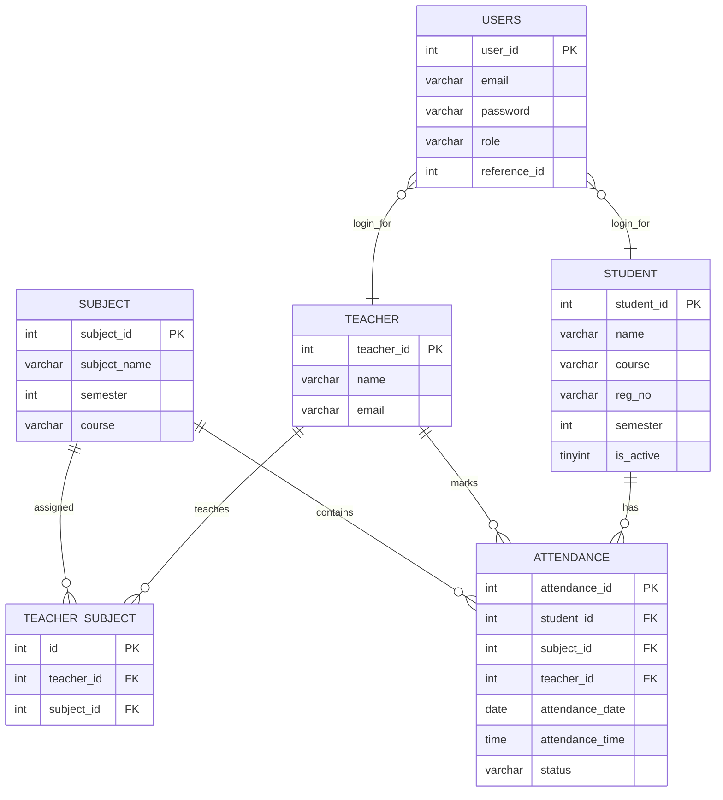

## Figure 6.3.1: Login Module DFD

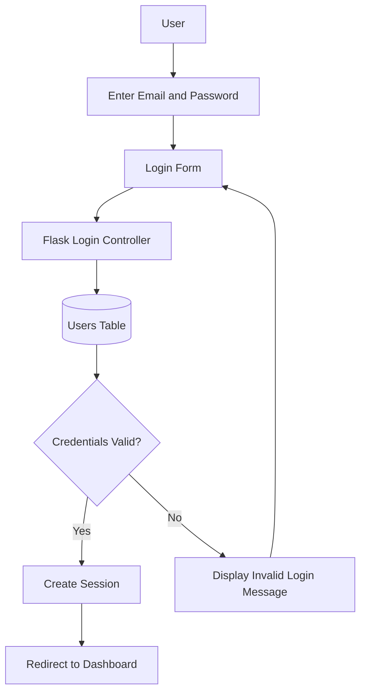

## Figure 6.3.2: Face Capture Module DFD

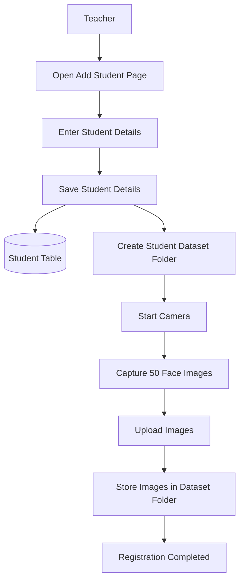

## Figure 6.3.3: Recognition Module DFD

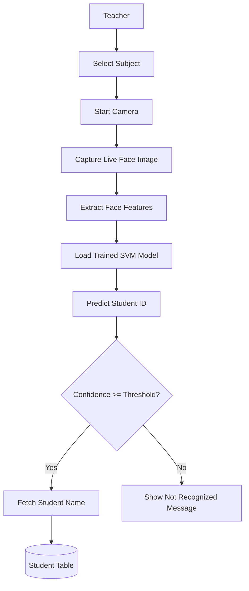

## Figure 6.3.4: Attendance Module DFD

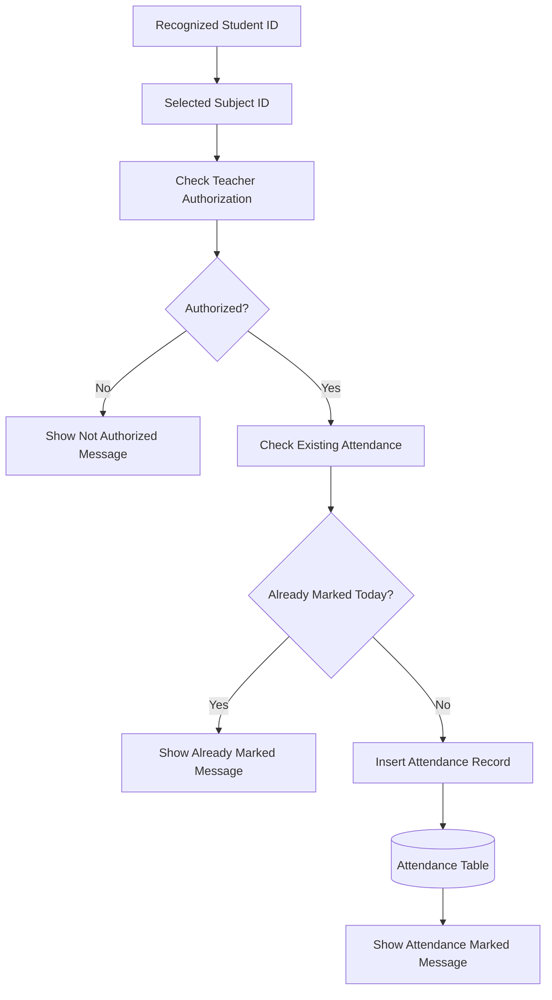

## Figure 6.4: Use Case Diagram

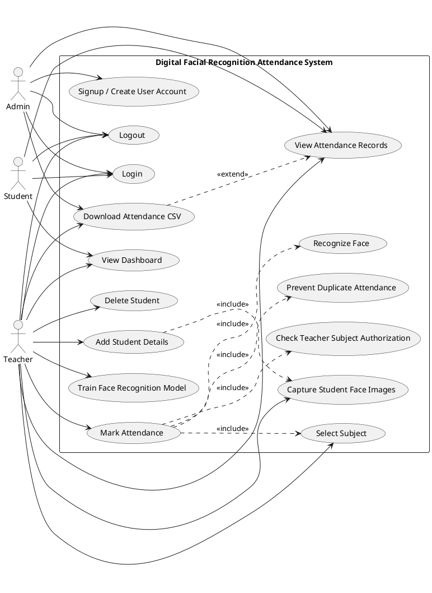

## Figure 7.1: Authentication Module Diagram

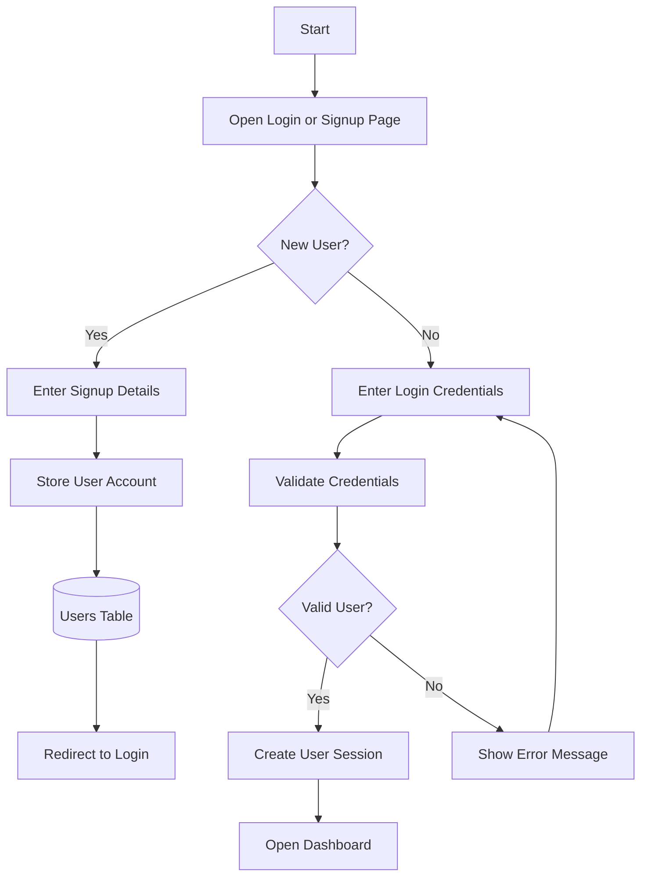

## Figure 7.2: Student Registration Module Diagram

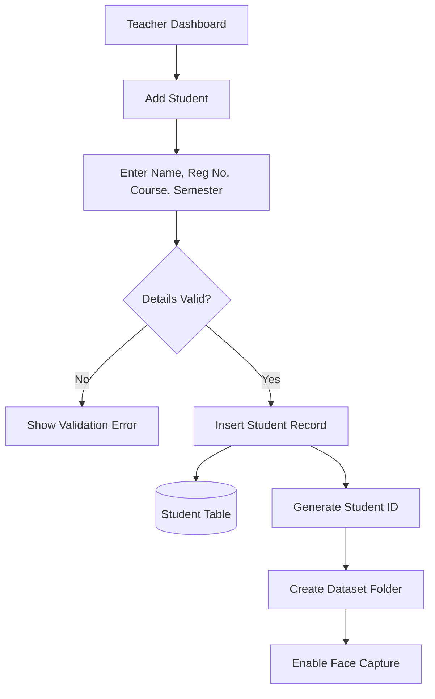

## Figure 7.3: Face Capture Module Diagram

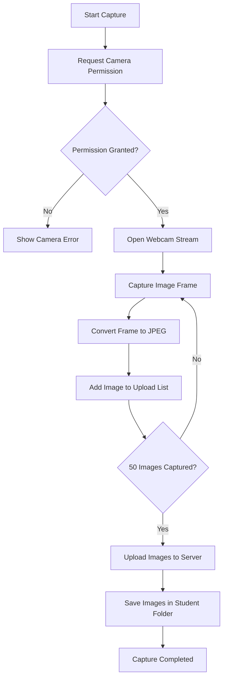

## Figure 7.4: Model Training Module Diagram

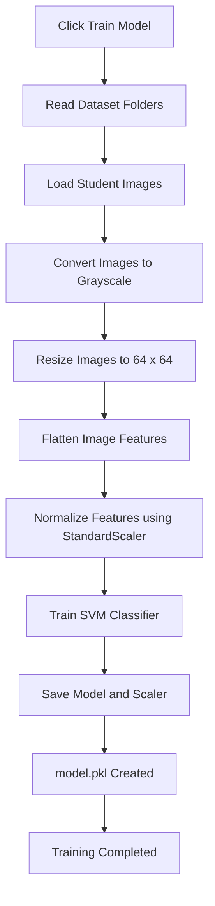

## Figure 7.5: Face Recognition Module Diagram

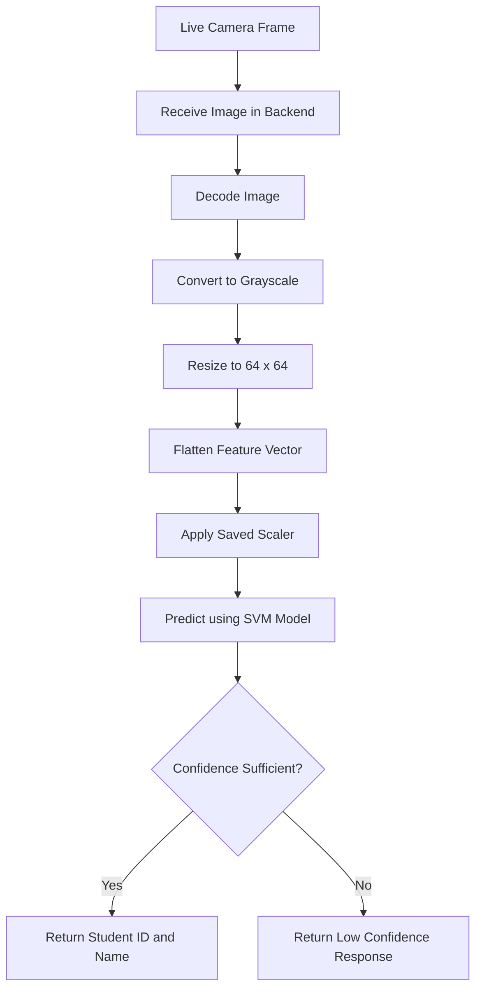

## Figure 7.6: Attendance Management Module Diagram

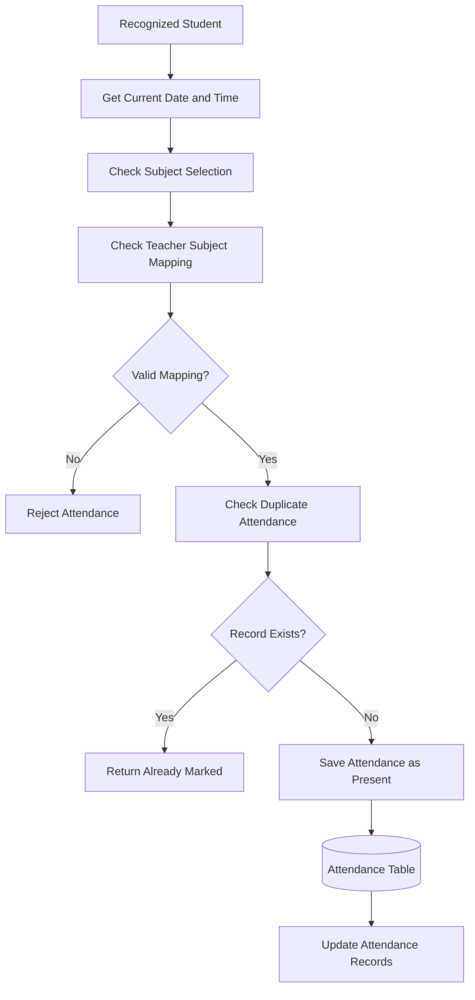

## Figure 7.7: Report Generation Module Diagram

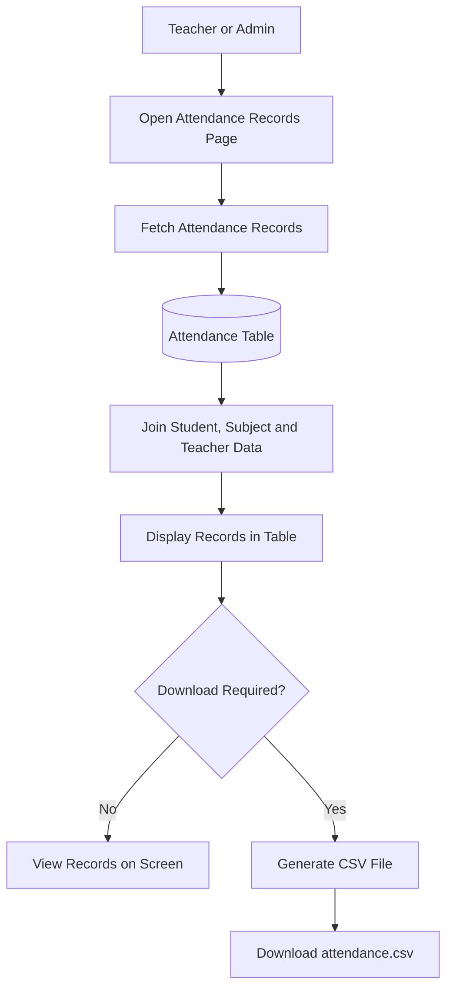
