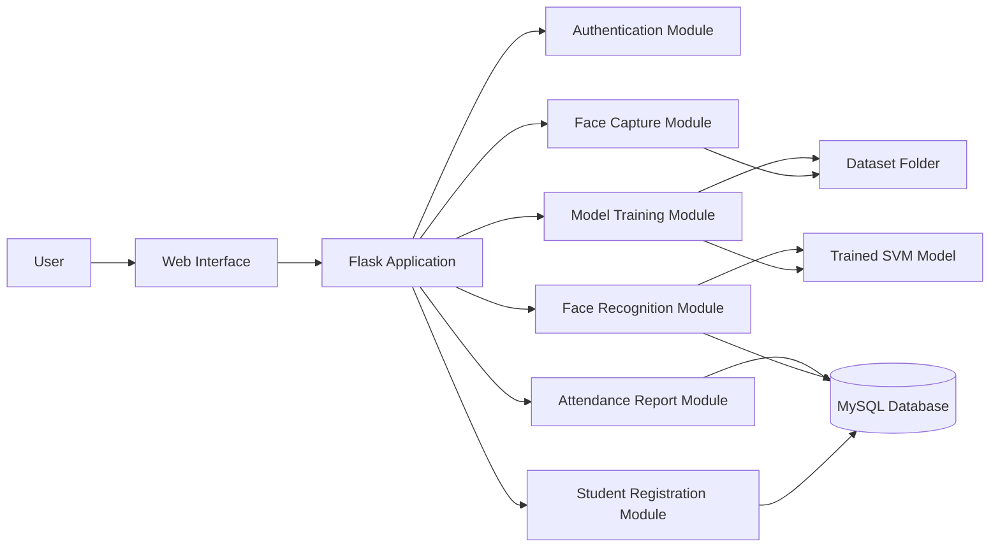
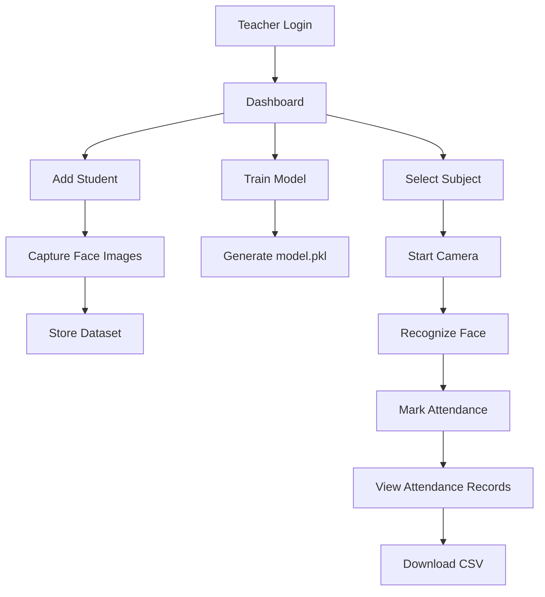
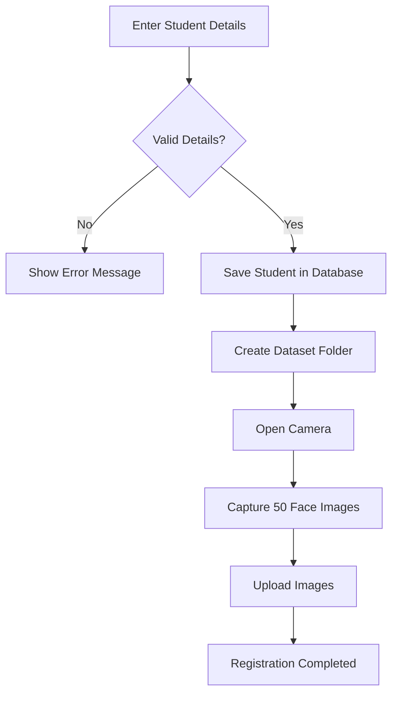
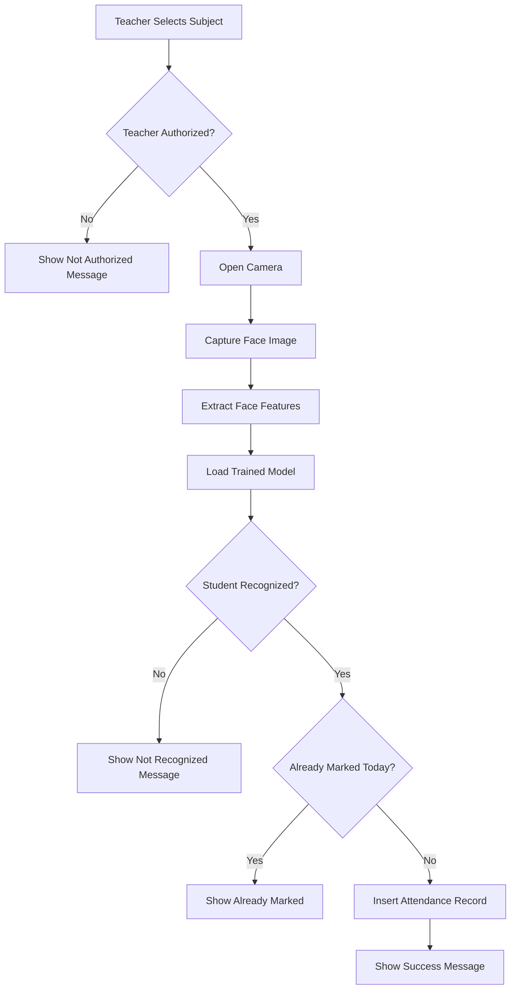
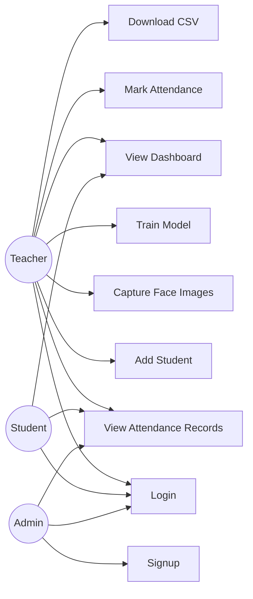

# Report Material: Digital Facial Recognition Attendance System

## 6. Database Tables

### 6.1 Database Table Design

### 6.1.1 Users Table

| Field Name | Type | Key | Description |
|---|---|---|---|
| user_id | INT | Primary Key | Unique login user id |
| email | VARCHAR(100) | Unique | User email used for login |
| password | VARCHAR(100) |  | User password |
| role | VARCHAR(20) |  | Role of user: teacher, student or admin |
| reference_id | INT | Foreign Key | Refers to teacher_id or student_id based on role |

Table 6.1.1: Users Table Structure

### 6.1.2 Student Table

| Field Name | Type | Key | Description |
|---|---|---|---|
| student_id | INT | Primary Key | Unique student id |
| name | VARCHAR(100) |  | Student full name |
| course | VARCHAR(50) |  | Course name |
| reg_no | VARCHAR(50) | Unique | Student registration number |
| semester | INT |  | Current semester |
| is_active | TINYINT |  | Student active status |

Table 6.1.2: Student Table Structure

### 6.1.3 Teacher Table

| Field Name | Type | Key | Description |
|---|---|---|---|
| teacher_id | INT | Primary Key | Unique teacher id |
| name | VARCHAR(100) |  | Teacher name |
| email | VARCHAR(100) | Unique | Teacher email id |

Table 6.1.3: Teacher Table Structure

### 6.1.4 Subject Table

| Field Name | Type | Key | Description |
|---|---|---|---|
| subject_id | INT | Primary Key | Unique subject id |
| subject_name | VARCHAR(100) |  | Name of the subject |
| semester | INT |  | Semester in which subject is taught |
| course | VARCHAR(50) |  | Course name |

Table 6.1.4: Subject Table Structure

### 6.1.5 Teacher Subject Table

| Field Name | Type | Key | Description |
|---|---|---|---|
| id | INT | Primary Key | Unique mapping id |
| teacher_id | INT | Foreign Key | Refers to teacher table |
| subject_id | INT | Foreign Key | Refers to subject table |

Table 6.1.5: Teacher Subject Table Structure

### 6.1.6 Attendance Table

| Field Name | Type | Key | Description |
|---|---|---|---|
| attendance_id | INT | Primary Key | Unique attendance id |
| student_id | INT | Foreign Key | Refers to student table |
| subject_id | INT | Foreign Key | Refers to subject table |
| teacher_id | INT | Foreign Key | Refers to teacher table |
| attendance_date | DATE |  | Date of attendance |
| attendance_time | TIME |  | Time of attendance |
| status | VARCHAR(20) |  | Attendance status, usually Present |

Table 6.1.6: Attendance Table Structure

## 6.2 E-R Diagram

```mermaid
erDiagram
    USERS {
        int user_id PK
        varchar email UK
        varchar password
        varchar role
        int reference_id FK
    }

    STUDENT {
        int student_id PK
        varchar name
        varchar course
        varchar reg_no UK
        int semester
        tinyint is_active
    }

    TEACHER {
        int teacher_id PK
        varchar name
        varchar email UK
    }

    SUBJECT {
        int subject_id PK
        varchar subject_name
        int semester
        varchar course
    }

    TEACHER_SUBJECT {
        int id PK
        int teacher_id FK
        int subject_id FK
    }

    ATTENDANCE {
        int attendance_id PK
        int student_id FK
        int subject_id FK
        int teacher_id FK
        date attendance_date
        time attendance_time
        varchar status
    }

    TEACHER ||--o{ TEACHER_SUBJECT : handles
    SUBJECT ||--o{ TEACHER_SUBJECT : assigned_to
    STUDENT ||--o{ ATTENDANCE : has
    SUBJECT ||--o{ ATTENDANCE : contains
    TEACHER ||--o{ ATTENDANCE : marks
    USERS }o--|| TEACHER : teacher_login
    USERS }o--|| STUDENT : student_login
```

Figure 6.2: Database ER-Diagram

## 6.3 Block Diagrams / Data Flow Diagrams

### 6.3.1 System Block Diagram

Figure 6.3.1: System Block Diagram

### 6.3.2 Teacher Module

Figure 6.3.2: DFD for Teacher Module

### 6.3.3 Student Registration Flow

Figure 6.3.3: DFD for Student Registration

### 6.3.4 Attendance Marking Flow

Figure 6.3.4: DFD for Attendance Marking

## 6.4 Use Case Diagram

Figure 6.4: Use Case Diagram

## 9. Testing

Software testing is the process of executing a program with the intent of finding errors. The testing process checks both the internal logic of the system and the external functionality to ensure that valid inputs produce the expected output.

### 9.1 Test Cases

### 9.1.1 Test Case for Login Form

| Sl. No | Test Case Id | Test Case Name | Test Case Description | Steps | Expected Result | Actual Result | Status |
|---|---|---|---|---|---|---|---|
| 1 | TC_LOGIN_01 | Valid Login | To verify login using valid email and password | Enter valid email and password and click Login | Dashboard should be displayed | Dashboard displayed successfully | Pass |
| 2 | TC_LOGIN_02 | Invalid Login | To verify login using wrong credentials | Enter invalid email or password and click Login | Invalid email or password message should be displayed | Error message displayed | Pass |
| 3 | TC_LOGIN_03 | Empty Login | To verify login without required fields | Keep email or password empty and click Login | Form validation or login error should be shown | Validation/error displayed | Pass |

Table 9.1.1: Test Case for Login Form

### 9.1.2 Test Case for Signup Form

| Sl. No | Test Case Id | Test Case Name | Test Case Description | Steps | Expected Result | Actual Result | Status |
|---|---|---|---|---|---|---|---|
| 1 | TC_SIGNUP_01 | Valid Signup | To verify new user registration | Enter email, password, role and reference id, then submit | User should be registered and redirected to login page | User registered successfully | Pass |
| 2 | TC_SIGNUP_02 | Duplicate Email | To verify duplicate email validation | Enter an already registered email and submit | Email already registered message should be displayed | Error message displayed | Pass |
| 3 | TC_SIGNUP_03 | Missing Field | To verify required field validation | Leave email, password or reference id empty and submit | All fields are required message should be displayed | Error message displayed | Pass |

Table 9.1.2: Test Case for Signup Form

### 9.1.3 Test Case for Add Student

| Sl. No | Test Case Id | Test Case Name | Test Case Description | Steps | Expected Result | Actual Result | Status |
|---|---|---|---|---|---|---|---|
| 1 | TC_STUDENT_01 | Add Student | To verify student details are saved | Enter name, reg no, course, semester and click Save Info | Student id should be generated | Student saved successfully | Pass |
| 2 | TC_STUDENT_02 | Empty Student Name | To verify name validation | Leave name empty and submit | Name required error should be displayed | Error displayed | Pass |
| 3 | TC_STUDENT_03 | Capture Face Images | To verify face image capture | Click Start Capture and allow camera access | 50 face images should be captured and uploaded | Images uploaded successfully | Pass |

Table 9.1.3: Test Case for Add Student

### 9.1.4 Test Case for Train Model

| Sl. No | Test Case Id | Test Case Name | Test Case Description | Steps | Expected Result | Actual Result | Status |
|---|---|---|---|---|---|---|---|
| 1 | TC_TRAIN_01 | Train With Dataset | To verify model training with sufficient images | Add students with face images and click Train Model | Model training should complete and model.pkl should be created | Training completed successfully | Pass |
| 2 | TC_TRAIN_02 | Train Without Dataset | To verify training with insufficient data | Click Train Model without enough face images | Not enough data message should be shown | Error/status message displayed | Pass |
| 3 | TC_TRAIN_03 | Training Status | To verify training progress | Start training and check training status | Progress and status message should be displayed | Status displayed successfully | Pass |

Table 9.1.4: Test Case for Train Model

### 9.1.5 Test Case for Mark Attendance

| Sl. No | Test Case Id | Test Case Name | Test Case Description | Steps | Expected Result | Actual Result | Status |
|---|---|---|---|---|---|---|---|
| 1 | TC_ATT_01 | Valid Face Recognition | To verify recognized student attendance | Select subject, start camera and show registered face | Student should be recognized and attendance marked | Attendance marked successfully | Pass |
| 2 | TC_ATT_02 | No Subject Selected | To verify subject selection validation | Click Start without selecting subject | Please select a subject message should be displayed | Alert displayed | Pass |
| 3 | TC_ATT_03 | Unauthorized Subject | To verify teacher-subject authorization | Try to mark attendance for unassigned subject | Not authorized message should be displayed | Error displayed | Pass |
| 4 | TC_ATT_04 | Duplicate Attendance | To verify duplicate attendance prevention | Mark same student for same subject on same date again | Already marked message should be displayed | Already marked response displayed | Pass |
| 5 | TC_ATT_05 | Unrecognized Face | To verify unknown/low confidence face handling | Show an unregistered face to camera | Not recognized or low confidence message should be displayed | Error message displayed | Pass |

Table 9.1.5: Test Case for Mark Attendance

### 9.1.6 Test Case for Attendance Records

| Sl. No | Test Case Id | Test Case Name | Test Case Description | Steps | Expected Result | Actual Result | Status |
|---|---|---|---|---|---|---|---|
| 1 | TC_RECORD_01 | View Records | To verify attendance record display | Open Attendance Records page | Attendance records should be listed | Records displayed successfully | Pass |
| 2 | TC_RECORD_02 | Filter Records | To verify date filters | Click Today, This Week or This Month filter | Records should be filtered based on selected period | Records filtered successfully | Pass |
| 3 | TC_RECORD_03 | Download CSV | To verify CSV export | Click CSV download button | attendance.csv file should be downloaded | CSV downloaded successfully | Pass |

Table 9.1.6: Test Case for Attendance Records

